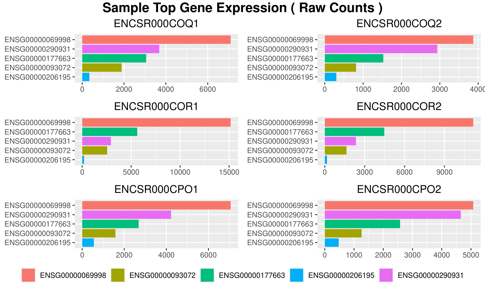
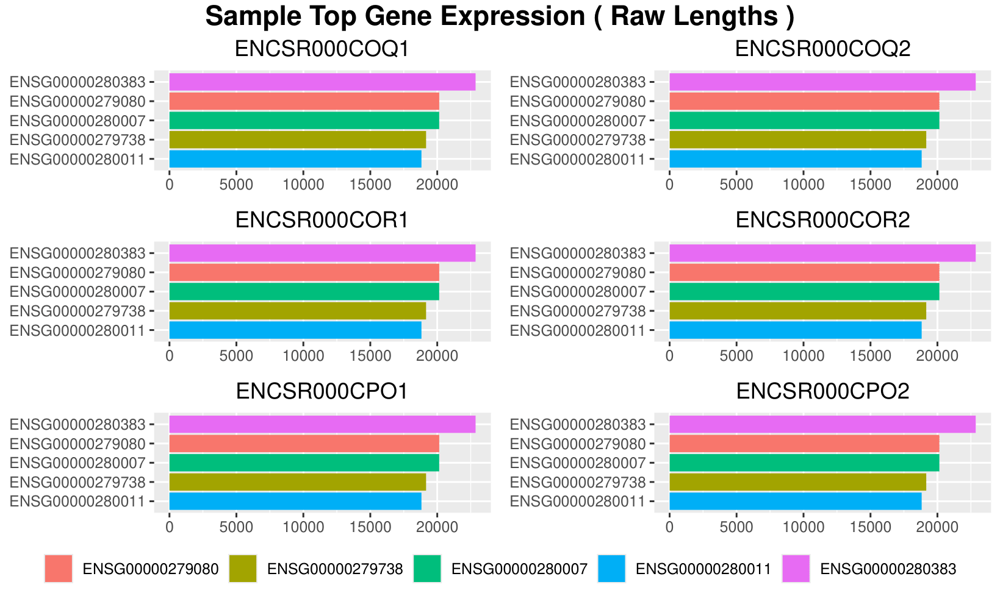
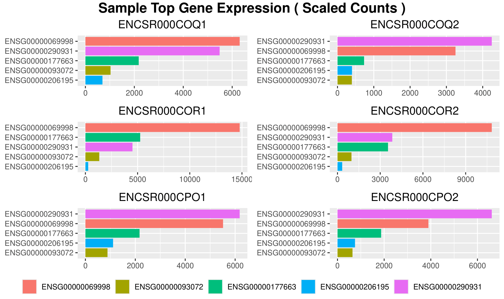
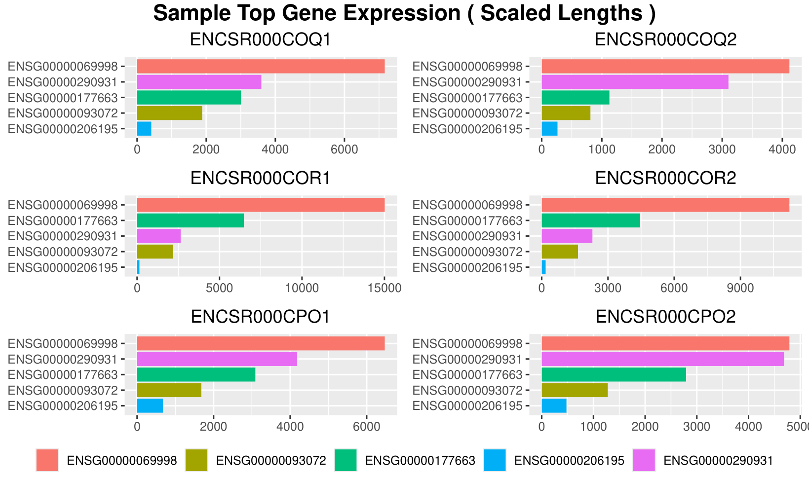
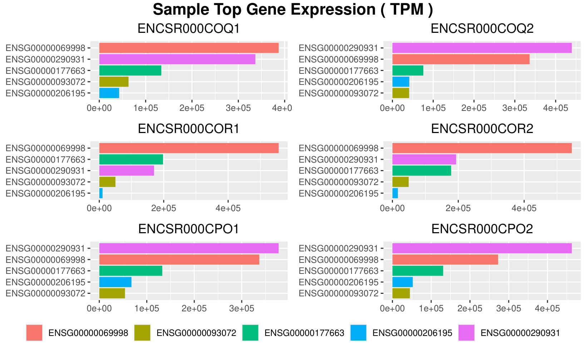

## NF-CORE/RNA-SEQ pipeline

This notebook was written in Google Collab and intended to be ran in that environment. View the markdown of the notebook for more details into the specific hardware requirement.

The notebook `RNA-seq-nf.ipynb` uses nf-core/rnaseq pipeline to produce all necessary outputs. View the notebook to learn how to download the data and organize them into the Google Collab environment. 

**Note that you will most likely need Google Collab Pro to run the pipeline. It is free for US students but if you can't run it, you can still view the RDS results and MULTIQC HTML page**

The `view_summerized_experiment.R` then takes each .RDS file produced by the pipeline and ranks each gene of every sample by their count/expression level.

### Citation
`The nf-core framework for community-curated bioinformatics pipelines.
Philip Ewels, Alexander Peltzer, Sven Fillinger, Harshil Patel, Johannes Alneberg, Andreas Wilm, Maxime Ulysse Garcia, Paolo Di Tommaso & Sven Nahnsen.
Nat Biotechnol. 2020 Feb 13. doi: 10.1038/s41587-020-0439-x.`

### Understanding each output from pipeline with command:
'''

!nextflow run nf-core/rnaseq \
    --input /content/drive/MyDrive/Colab_Notebooks/RNA-seq-nf/single-end.csv \
    --outdir nf_temp/$folder_name \
    --gtf /content/drive/MyDrive/Colab_Notebooks/RNA-seq-nf/Homo_sapiens.GRCh38.115.gtf.gz \
    --fasta $fasta_file_path \
    -profile conda

'''

### Basic processes are:
Overview: https://nf-co.re/rnaseq/3.22.2/docs/output/

Visit this link to see all the possible outputs of this pipeline. For now I am interested in:
1. Alignment and quantification
    - STAR & Salmon
2. Alignment post-processing
    - SAMtools
    - picard MarkDuplicates
3. Quality Control 
    - RSeQC
    - QualiMap
    - DupRadar
    - featureCounts
    - DESeq2
    - MultiQC

There are many more features in this pipeline, but the primary objective of this project is to:
1. perform RNAseq analysis on reads from the: https://www.encodeproject.org/
    - this includes aligning reads to chromasome 22
2. validate process with quality control parameters
    - go over the output files, specifically from MULTIQC's generated HTML page
3. Use R to visualize the RDS file produced by the output.
    - we will be comparing raw counts, scaled counts, tpm, length scared counts, and gene lengths

## RDS Gene Expression Metrics

